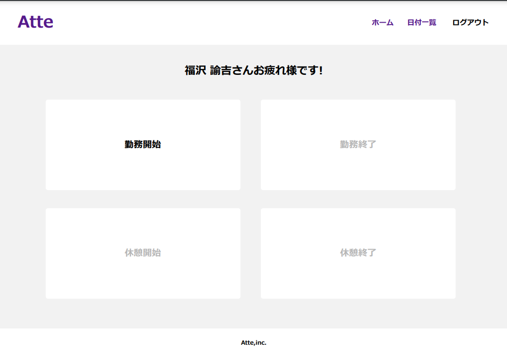
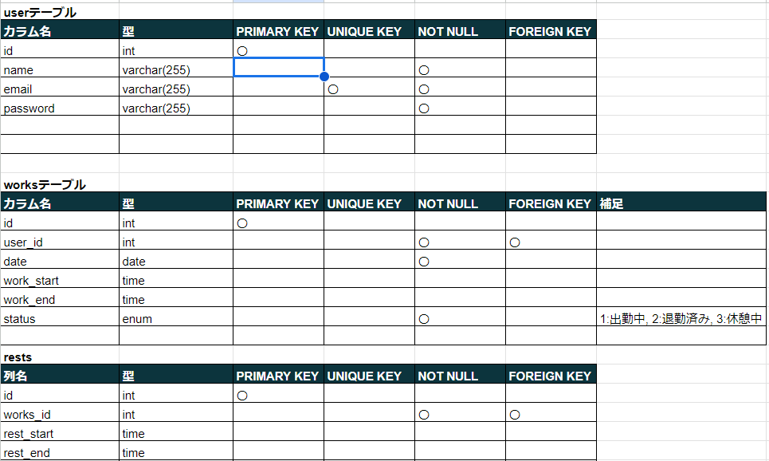
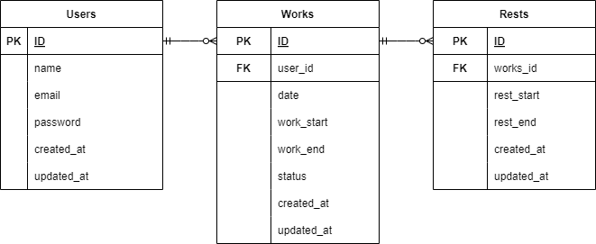

# Atte(勤怠管理アプリ)


## 作成した目的
社員の勤怠状況による人事評価を目的として作成

## 機能一覧
- メールアドレス・パスワードによる社員登録
- 勤怠管理システムへのログイン・ログアウト
- 出退勤時の打刻（日付を跨いだ時点で翌日の出勤操作へ切替）
- 休憩開始・終了時の打刻（1日に何度でも休憩可能）
- 日付別勤怠情報の取得（実働時間の確認）

## 環境構築
**Dockerビルド**
1. ファイルを作成したいディレクトリ以下に開発環境をクローンする  
`git clone git@github.com:leoandrandy/atte.git`
2. `docker-compose.yml`ファイルがあるディレクトリへ移動する  
`cd atte`
3. DockerDesktopアプリを立ち上げる  
`docker-compose up -d --build`

**Laravel環境構築**
1. `docker-compose exec php bash`（PHPコンテナに入る）
2. `composer install`
3. 「.env.example」ファイルを 「.env」ファイルに命名変更。  
`cp .env.example .env`  
`exit`（PHPコンテナから出る）
4. .envファイルの修正  
「docker-compose.yml」のenvironment部分と同じになるよう環境変数を変更
``` text
DB_CONNECTION=mysql
DB_HOST=mysql
DB_PORT=3306
DB_DATABASE=laravel_db
DB_USERNAME=laravel_user
DB_PASSWORD=laravel_pass
```  
※権限エラーが出てしまう場合は下記コマンドを実行  
`sudo chmod -R 777 src`  

5. アプリケーションキーの作成(PHPコンテナ)
``` bash
php artisan key:generate
```

6. マイグレーションの実行(PHPコンテナ)
``` bash
php artisan migrate
```

7. シーディングの実行(PHPコンテナ)
``` bash
php artisan db:seed
```

## 使用技術(実行環境)
- laravel Framework 8.83.8
- PHP 7.4.9
- mysql 8.0.26
- phpMyAdmin 5.2.1

## テーブル設計


## ER図


## URL
- 開発環境：http://localhost/
- phpMyAdmin:：http://localhost:8080/